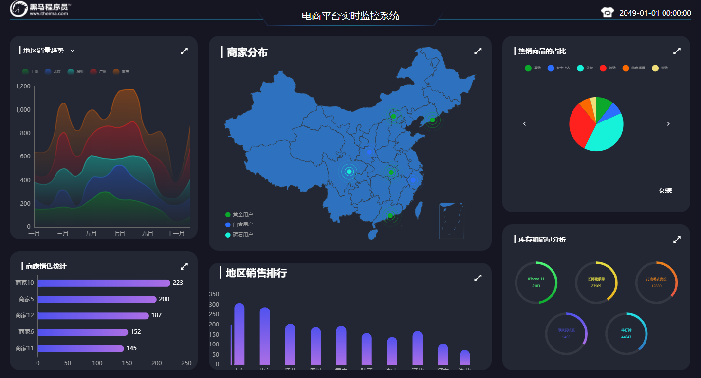

---

---

# vision
使用Vue全家桶+ECharts+Koa2+WebSocket搭建的可视化电商平台实时监控系统

## 技术栈

1. echarts
2. vue全家桶
3. koa2
4. websocket

## 效果图

## 线上访问地址

http://huangjiangjun.top/vision

## Echarts Demo

https://github.com/Duanzihuang/vision/tree/master/echarts-demo

## 服务端

https://github.com/Duanzihuang/vision/tree/master/server

## 客户端

https://github.com/Duanzihuang/vision/tree/master/client