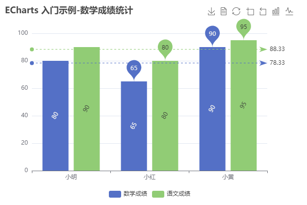
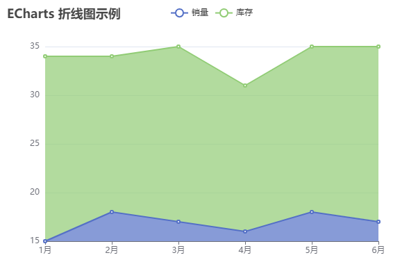
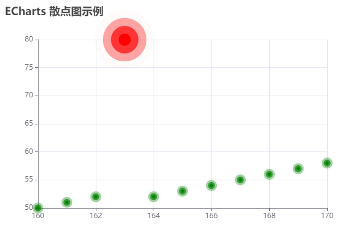
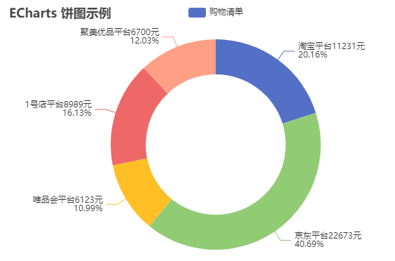
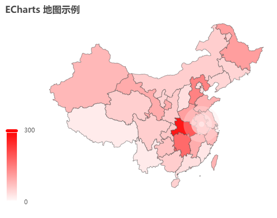
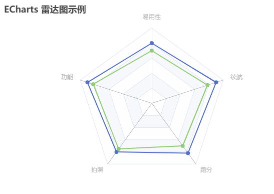
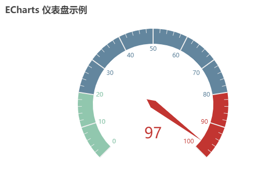

# Echarts
## Echarts基础

> 入门Demo

效果


代码

```html
<!DOCTYPE html>
<html lang="en">
  <head>
    <meta charset="UTF-8" />
    <meta name="viewport" content="width=device-width, initial-scale=1.0" />
    <title>Echarts入门demo</title>
    <script src="https://cdn.bootcdn.net/ajax/libs/echarts/5.0.0-alpha.1/echarts.js"></script>
  </head>
  <body>
    <div id="container" style="width:600px;height: 400px;"></div>
  </body>
  <script>
    // 基于准备好的dom，初始化echarts实例
    const myChart = echarts.init(document.getElementById('container'))

    // 指定图表的配置项和数据
    const option = {
      title: {
        text: 'ECharts 入门示例-数学成绩统计'
      },
      xAxis: {
        type: 'category', // 类目轴
        data: ['小明', '小红', '小黄']
      },
      yAxis: {
        type: 'value' // 数值轴
      },
      series: [
        {
          name: '数学成绩',
          type: 'bar', // 图表类型
          data: [80, 65, 90]
        }
      ]
    }

    // 使用刚指定的配置项和数据显示图表。
    myChart.setOption(option)
  </script>
</html>
```
> 配置项【重要】

配置项参考：https://echarts.apache.org/zh/option.html

常用配置项解析

- title：标题

  文字样式 ：textStyle

  标题边框：borderWidth、borderColor、borderRadius

  标题位置：left、top、right、bottom

- dataZoom：区域缩放，它的值是一个数组，支持多段缩放

  type：slider（滑块）、inside（鼠标滚轮或双指缩放）

  xAxisIndex：0 哪个x轴起作用

  yAxisIndex：0 哪个y轴起作用

  start：缩放开始位置

  end：缩放结束位置

- grid: 网格，是x轴和y轴的依附，控制图表大小和位置

  是否显示：show

  边框宽度：borderWidth

  边框颜色

  边框位置

- axis：坐标

  xAxis：x坐标

  yAxis：y坐标

- tooltip：提示框组件，用于配置鼠标滑过或点击图标时的显示框

  触发类型：trigger（item、axis）

  触发时机：triggerOn（mousemove、click）

  格式化：formatter（字符串模板、回调函数）

- toolbox：ECharts提供的工具栏

  导出图片：feature.saveAsImage

  数据视图：feature.dataView

  动态类型切换：feature.magicType.type

  数据区域缩放：feature.dataZoom

  重置：feature.restore

- legend：图例，用于筛选系列，需要和series配合使用

  data：是一个数组，它的值需要和series数组中的某组数据的name值一致

- xAxis：直角坐标系中的x轴

- yAxis：直角坐标系中的y轴

- series：系列列表。每个系列通过type决定自己的图表类型

> 柱状图

效果



代码

```html
<!DOCTYPE html>
<html lang="en">
  <head>
    <meta charset="UTF-8" />
    <meta name="viewport" content="width=device-width, initial-scale=1.0" />
    <title>Echarts入门demo</title>
    <script src="https://cdn.bootcdn.net/ajax/libs/echarts/5.0.0-alpha.1/echarts.js"></script>
  </head>
  <body>
    <div id="container" style="width:600px;height: 400px;"></div>
  </body>
  <script>
    // 基于准备好的dom，初始化echarts实例
    const myChart = echarts.init(document.getElementById('container'))

    // 指定图表的配置项和数据
    const option = {
      // 标题
      title: {
        text: 'ECharts 入门示例-数学成绩统计'
      },
      legend: {
        data: ['数学成绩', '语文成绩'],
        bottom: 0
      },
      // 提示
      tooltip: {
        // trigger: 'item'
        trigger: 'axis',
        // formatter: '{b} 的成绩是 {c}'
        formatter: arg => {
          return arg[0].name + ' 的分数是: ' + arg[0].data
        }
      },
      // 工具
      toolbox: {
        feature: {
          saveAsImage: {}, // 导出图片
          dataView: {}, //数据视图
          restore: {}, // 重置
          dataZoom: {}, // 区域缩放
          magicType: {
            // 动态类型切换
            type: ['bar', 'line']
          }
        }
      },
      xAxis: {
        type: 'category', // 类目轴
        data: ['小明', '小红', '小黄']
      },
      yAxis: {
        type: 'value' // 数值轴
      },
      series: [
        {
          name: '数学成绩',
          type: 'bar', // 图表类型
          // 最大最小值
          markPoint: {
            data: [
              {
                type: 'max',
                name: '最大值'
              },
              {
                type: 'min',
                name: '最小值'
              }
            ]
          },
          // 平均值
          markLine: {
            data: [
              {
                type: 'average',
                name: '平均值'
              }
            ]
          },
          // 是否显示内容
          label: {
            show: true,
            rotate: 60, // 旋转60度
            position: 'inside' // 位置
          },
          // barWidth: '30%',
          data: [80, 65, 90]
        },
        {
          name: '语文成绩',
          type: 'bar',
          markPoint: {
            data: [
              {
                type: 'max',
                name: '最大值'
              },
              {
                type: 'min',
                name: '最小值'
              }
            ]
          },
          // 平均值
          markLine: {
            data: [
              {
                type: 'average',
                name: '平均值'
              }
            ]
          },
          // 是否显示内容
          label: {
            show: true,
            rotate: 60, // 旋转60度
            position: 'inside' // 位置
          },
          data: [90, 80, 95]
        }
      ]
    }

    // 使用刚指定的配置项和数据显示图表。
    myChart.setOption(option)
  </script>
</html>
```

常见属性

- 标记：最大值、最小值、平均值

  markPoint

  markLine

- 显示：数值显示、柱宽度、横向柱状图

  label

  barWidth

  更改x轴和y轴的角色

> 折线图

效果



代码

```html
<!DOCTYPE html>
<html lang="en">
  <head>
    <meta charset="UTF-8" />
    <meta name="viewport" content="width=device-width, initial-scale=1.0" />
    <title>折线图</title>
    <script src="https://cdn.bootcdn.net/ajax/libs/echarts/5.0.0-alpha.1/echarts.js"></script>
  </head>
  <body>
    <!-- 为ECharts准备一个具备大小（宽高）的Dom -->
    <div id="main" style="width: 600px;height:400px;"></div>
    <script type="text/javascript">
      // 基于准备好的dom，初始化echarts实例
      var myChart = echarts.init(document.getElementById('main'))

      // 指定图表的配置项和数据
      var option = {
        title: {
          text: 'ECharts 折线图示例'
        },
        tooltip: {},
        legend: {
          data: ['销量', '库存']
        },
        xAxis: {
          data: ['1月', '2月', '3月', '4月', '5月', '6月'],
          boundaryGap: false
        },
        yAxis: {
          type: 'value',
          scale: true
        },
        series: [
          {
            name: '销量',
            type: 'line',
            // data: [5, 20, 36, 10, 10, 20]
            data: [15, 18, 17, 16, 18, 17],
            stack: 'all',
            areaStyle: {}
          },
          {
            name: '库存',
            type: 'line',
            // data: [5, 20, 36, 10, 10, 20]
            data: [19, 16, 18, 15, 17, 18],
            stack: 'all',
            areaStyle: {}
          }
        ]
      }

      // 使用刚指定的配置项和数据显示图表。
      myChart.setOption(option)
    </script>
  </body>
</html>
```

常见属性

- 标记：最大值（markPoint）、最小值（markPoint）、平均值（markLine）、标注区间（markArea）
- 线条控制：平滑（smooth） 风格（lineStyle）
- 填充风格：areaStyle
- 仅挨边缘：boundaryGap
- 缩放：scale
- 堆叠图：stack、areaStyle

> 散点图

作用：散点图可以帮助我们推断出变量间的相关性，比如身高和体重的关系，也经常用在地图的标注上

效果



代码

```html
<!DOCTYPE html>
<html lang="en">
  <head>
    <meta charset="UTF-8" />
    <meta name="viewport" content="width=device-width, initial-scale=1.0" />
    <title>散点图</title>
    <script src="https://cdn.bootcdn.net/ajax/libs/echarts/5.0.0-alpha.1/echarts.js"></script>
  </head>
  <body>
    <!-- 为ECharts准备一个具备大小（宽高）的Dom -->
    <div id="main" style="width: 600px;height:400px;"></div>
    <script type="text/javascript">
      // 基于准备好的dom，初始化echarts实例
      var myChart = echarts.init(document.getElementById('main'))

      // 指定图表的配置项和数据
      var option = {
        title: {
          text: 'ECharts 散点图示例'
        },
        tooltip: {},
        xAxis: {
          type: 'value',
          scale: true
        },
        yAxis: {
          type: 'value',
          scale: true
        },
        series: [
          {
            name: '身高-体重',
            // type: 'scatter',
            type: 'effectScatter',
            // showEffectOn: 'emphasis', // render emphasis
            rippleEffect: {
              scale: 5
            },
            data: [
              [160, 50],
              [161, 51],
              [162, 52],
              [163, 80],
              [164, 52],
              [165, 53],
              [166, 54],
              [167, 55],
              [168, 56],
              [169, 57],
              [170, 58]
            ],
            symbolSize: function (arg) {
              const height = arg[0] / 100
              const weigth = arg[1]
              // bmi = 体重(kg) / 身高(m) * 身高(m) 代表28就代表肥胖
              const bmi = weigth / (height * height)
              if (bmi > 28) {
                return 20
              }

              return 5
            },
            itemStyle: {
              color: function (arg) {
                const height = arg.data[0] / 100
                const weigth = arg.data[1]
                // bmi = 体重(kg) / 身高(m) * 身高(m) 代表28就代表肥胖
                const bmi = weigth / (height * height)
                if (bmi > 28) {
                  return 'red'
                }

                return 'green'
              }
            }
          }
        ]
      }

      // 使用刚指定的配置项和数据显示图表。
      myChart.setOption(option)
    </script>
  </body>
</html>
```

常见效果

- 气泡效果图：

  散点的大小不同：symbolSize

  散点图颜色不同：itemStyle.color

- 涟漪动画效果：

  type：effectScatter

  rippleEffect.scale

  showEffectOn: 展现动画时机，两个可选值(render、emphasis)

> 饼图

作用：饼图可以很好地帮助用户快速了解不同分类的数据的占比情况

效果



代码

```html
<!DOCTYPE html>
<html lang="en">
  <head>
    <meta charset="UTF-8" />
    <meta name="viewport" content="width=device-width, initial-scale=1.0" />
    <title>饼图</title>
    <script src="https://cdn.bootcdn.net/ajax/libs/echarts/5.0.0-alpha.1/echarts.js"></script>
  </head>
  <body>
    <!-- 为ECharts准备一个具备大小（宽高）的Dom -->
    <div id="main" style="width: 600px;height:400px;"></div>
    <script type="text/javascript">
      // 基于准备好的dom，初始化echarts实例
      var myChart = echarts.init(document.getElementById('main'))

      // 指定图表的配置项和数据
      var option = {
        title: {
          text: 'ECharts 饼图示例'
        },
        tooltip: {},
        legend: {
          data: ['购物清单']
        },
        series: [
          {
            name: '购物清单',
            type: 'pie',
            label: {
              show: true,
              formatter: function (arg) {
                return (
                  arg.name + '平台' + arg.value + '元\n' + arg.percent + '%'
                )
              }
            },
            radius: ['50%', '75%'],
            selectedMode: 'single',
            data: [
              {
                name: '淘宝',
                value: 11231
              },
              {
                name: '京东',
                value: 22673
              },
              {
                name: '唯品会',
                value: 6123
              },
              {
                name: '1号店',
                value: 8989
              },
              {
                name: '聚美优品',
                value: 6700
              }
            ]
          }
        ]
      }

      // 使用刚指定的配置项和数据显示图表。
      myChart.setOption(option)
    </script>
  </body>
</html>
```

常见效果：

- 格式化文字

  label.show

  label.formatter

- 圆环

  radius：[内环半径，外环半径]

- 南丁格尔图

  roseType：‘radius’

- 选中效果

  seletedMode： 'single' | 'multiple'

  selectedOffset：30

> 地图

作用：地图主要可以帮助我们从宏观的角度快速看出不同地理位置上数据的差异

效果：



代码：

```html
<!DOCTYPE html>
<html lang="en">
  <head>
    <meta charset="UTF-8" />
    <meta name="viewport" content="width=device-width, initial-scale=1.0" />
    <title>地图</title>
    <script src="https://cdn.bootcdn.net/ajax/libs/echarts/5.0.0-alpha.1/echarts.js"></script>
    <script src="https://cdn.bootcdn.net/ajax/libs/axios/0.20.0-0/axios.js"></script>
  </head>
  <body>
    <!-- 为ECharts准备一个具备大小（宽高）的Dom -->
    <div id="main" style="width: 600px;height:400px;"></div>
    <script type="text/javascript">
      // 基于准备好的dom，初始化echarts实例
      var myChart = echarts.init(document.getElementById('main'))

      //1. 显示基本的中国地图
      //2. 将空气质量的数据设置给series下的对象
      //3. 将series下的数据和geo关联起来
      //4. 配置visualMap
      var airData = [
        { name: '北京', value: 39.92 },
        { name: '天津', value: 39.13 },
        { name: '上海', value: 31.22 },
        { name: '重庆', value: 66 },
        { name: '河北', value: 147 },
        { name: '河南', value: 113 },
        { name: '云南', value: 25.04 },
        { name: '辽宁', value: 50 },
        { name: '黑龙江', value: 114 },
        { name: '湖南', value: 175 },
        { name: '安徽', value: 117 },
        { name: '山东', value: 92 },
        { name: '新疆', value: 84 },
        { name: '江苏', value: 67 },
        { name: '浙江', value: 84 },
        { name: '江西', value: 96 },
        { name: '湖北', value: 273 },
        { name: '广西', value: 59 },
        { name: '甘肃', value: 99 },
        { name: '山西', value: 39 },
        { name: '内蒙古', value: 58 },
        { name: '陕西', value: 61 },
        { name: '吉林', value: 51 },
        { name: '福建', value: 29 },
        { name: '贵州', value: 71 },
        { name: '广东', value: 38 },
        { name: '青海', value: 57 },
        { name: '西藏', value: 24 },
        { name: '四川', value: 58 },
        { name: '宁夏', value: 52 },
        { name: '海南', value: 54 },
        { name: '台湾', value: 88 },
        { name: '香港', value: 66 },
        { name: '澳门', value: 77 },
        { name: '南海诸岛', value: 55 }
      ]
      var scatterData = [
        {
          value: [117.283042, 31.86119]
        }
      ]
      axios.get('http://huangjiangjun.top/echarts/china.json').then(res => {
        echarts.registerMap('chinaMap', res.data)

        const option = {
          title: {
            text: 'ECharts 地图示例'
          },
          geo: {
            type: 'map',
            map: 'chinaMap',
            roam: true, // 设置允许缩放以及拖动的效果
            label: {
              // show: true
            }
          },
          series: [
            {
              data: airData,
              geoIndex: 0, // 将空气质量的数据和第0个geo配置关联在一起
              type: 'map'
            },
            {
              data: scatterData, // 配置散点的坐标数据
              type: 'effectScatter',
              coordinateSystem: 'geo', // 指明散点使用的坐标系统 geo的坐标系统
              rippleEffect: {
                scale: 10 // 设置涟漪动画的缩放比例
              }
            }
          ],
          visualMap: {
            min: 0,
            max: 300,
            inRange: {
              color: ['white', 'red'] // 控制颜色渐变的范围
            },
            calculable: true // 出现滑块
          }
        }

        // 使用刚指定的配置项和数据显示图表。
        myChart.setOption(option)
      })
    </script>
  </body>
</html>
```

常用配置：

- 缩放拖动

  roam：true

- 名称显示

  label.show

- 初始化缩放比例

  zoom

- 地图中心点

  center：[经度、纬度]

> 雷达图

作用：雷达图可以用来分析多个维度的数据与标准数据的对比情况

效果：



代码：

```html
<!DOCTYPE html>
<html lang="en">
  <head>
    <meta charset="UTF-8" />
    <meta name="viewport" content="width=device-width, initial-scale=1.0" />
    <title>雷达图</title>
    <script src="https://cdn.bootcdn.net/ajax/libs/echarts/5.0.0-alpha.1/echarts.js"></script>
  </head>
  <body>
    <!-- 为ECharts准备一个具备大小（宽高）的Dom -->
    <div id="main" style="width: 600px;height:400px;"></div>
    <script type="text/javascript">
      //1. ECharts最基本的代码结构
      //2. 定义各个维度的最大值, 通过radar属性配置
      //   易用性,功能,拍照,跑分,续航, 每个维度的最大值都是100
      //3. 准备产品数据, 设置给series下的data
      //   华为手机1: 80, 90, 80, 82, 90
      //   中兴手机1: 70, 82, 75, 70, 78
      //4. 将type的值设置为radar

      // 基于准备好的dom，初始化echarts实例
      var myChart = echarts.init(document.getElementById('main'))

      // 各个维度的最大值
      var dataMax = [
        {
          name: '易用性',
          max: 100
        },
        {
          name: '功能',
          max: 100
        },
        {
          name: '拍照',
          max: 100
        },
        {
          name: '跑分',
          max: 100
        },
        {
          name: '续航',
          max: 100
        }
      ]

      // 指定图表的配置项和数据
      var option = {
        title: {
          text: 'ECharts 雷达图示例'
        },
        radar: {
          indicator: dataMax, // 配置各个维度的最大值
          shape: 'polygon' // 配置雷达图最外层的图形 circle polygon
        },
        series: [
          {
            type: 'radar', // radar 此图表示的是一个雷达图
            label: {
              //   show: true
            },
            data: [
              {
                name: '华为P30',
                value: [80, 90, 80, 82, 90]
              },
              {
                name: '红米10',
                value: [70, 82, 75, 70, 78]
              }
            ]
            // areaStyle: {} // 将每一个产品的雷达图形成阴影的面积
          }
        ]
      }

      // 使用刚指定的配置项和数据显示图表。
      myChart.setOption(option)
    </script>
  </body>
</html>
```

常用配置：

- 显示数值：label
- 区域面积：areaStyle
- 绘制类型：radar.shape

> 仪表盘

作用：仪表盘可以更直观的表现出某个指标的进度或实际情况

效果：



代码：

```html
<!DOCTYPE html>
<html lang="en">
  <head>
    <meta charset="UTF-8" />
    <meta name="viewport" content="width=device-width, initial-scale=1.0" />
    <title>仪表盘</title>
    <script src="https://cdn.bootcdn.net/ajax/libs/echarts/5.0.0-alpha.1/echarts.js"></script>
  </head>
  <body>
    <!-- 为ECharts准备一个具备大小（宽高）的Dom -->
    <div id="main" style="width: 600px;height:400px;"></div>
    <script type="text/javascript">
      //1. ECharts最基本的代码结构
      //2. 准备数据, 设置给series下的data
      //3. 将type的值设置为gauge

      // 基于准备好的dom，初始化echarts实例
      var myChart = echarts.init(document.getElementById('main'))

      // 指定图表的配置项和数据
      var option = {
        title: {
          text: 'ECharts 仪表盘示例'
        },
        series: [
          {
            type: 'gauge',
            data: [
              {
                value: 97
                // itemStyle: { // 指针的样式
                //   color: 'pink' // 指针的颜色
                // }
              } // 每一个对象，代表一个指针
            ]
            // min: 50 // min max 控制仪表盘数值范围
          }
        ]
      }

      // 使用刚指定的配置项和数据显示图表。
      myChart.setOption(option)
    </script>
  </body>
</html>
```

## Echarts高级

> 显示相关

- 主题

  内置主题：light、dark

  自定义主题：https://echarts.apache.org/zh/theme-builder.html

- 调色盘

  主题调色盘

  全局调色盘

  局部调色盘

  线性渐变

  径向渐变

- 样式

  直接样式：itemStyle、textStyle、lineStyle、areaStyle、label

  高亮样式：在emphasis中包裹itemStyle、textStyle、lineStyle、areaStyle、label

- 自适应

  当浏览器的大小发生变化的时候，让图表也能随之适配变化

  监听窗口大小变化事件，在事件处理函数中调用ECharts实例对象的resize即可

> 动画使用

- 加载动画

  ECharts已经内置好了加载数据的动画，我们只需要在合适的时机显示或者隐藏即可

  显示加载动画：mCharts.showLoading()

  隐藏加载动画：mCharts.hideLoading()

- 增量动画

  ECharts会找到两组数据之间的差异然后通过合适的动画去表现数据的变化

  通过mCharts.setOption实现

- 动画的配置

  开启动画：anmiation: true

  动画时长：animationDuration: 500

  缓动动画：animationEasing: 'linear'

  动画阈值：animationThreshold: 8

> 交互API

- 全局echarts对象

  全局echarts对象是引入echarts.js文件之后就可以直接使用的

  常用方法：init、registerTheme、registerMap、connect(实现多图互动，比如下载的时候多个echarts图表一起下载)

- echartsInstance对象

  echartsInstance对象是通过echarts.init方法调用之后得到的

  常用方法：setOption、resize、on/off、dispatchAction、clear、dispose

  on/off：事件处理，可以处理鼠标事件和echarts的事件，参考：https://echarts.apache.org/zh/api.html#events